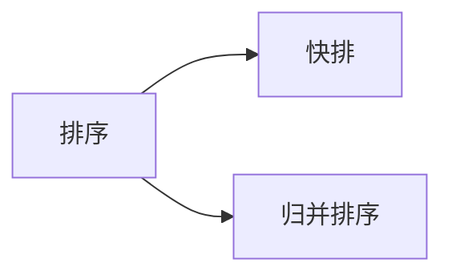
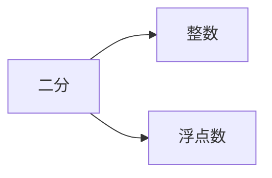

## 基础算法

```
课上：理解算法主要思想
课后：理解代码母版，背过（可以快速的写出模板题）
	 根据模板题写出例题
	 
提高熟练度：对一道题目重复3~5次
```


### 快速排序


- 第二步的第一种方法

  

  ```
  开两个数组，a，b
  遍历数组q，当q <= x，把当前遍历的数放到a中
  		 当q >x,把当前遍历的数放到b中
  再把a，b放到q中
  ```

- 第二步的第二种方法

  ```
  	用两个指针，左端点i，右端点j，分别往中间走，i先走，i<x向后移动一位；i>=x，那么这个数应该要放到右半边，此时i保持不动；移动j，j一直往中间走，直到j指向的数<=x（这个数应该要放到左半边），此时，交换这两个数，这样这两个数都放好了位置，i、j继续往中间走，直到i和j相遇
  	
  	为什么是对的：i左边所有的数都<=x，j右边所有的数都>=x，当两个数相遇时也满足这样的条件，所以这样是对的。
  ```

  

- 代码模板

  ```c++
  #include <iostream>
  
  using namespace std;
  
  const int N = 1e6 + 10;
  
  int n;
  int q[N];
  
  void quick_sort(int q[], int l, int r)
  {
      // 判断边界
      if (l >= r) return;
      
      // 取分界点，定义两个指针
      int x = q[(l + r)/2], i = l - 1, j = r + 1;
      
      // 迭代
      while (i < j)
      {
          do i ++; while (q[i] < x);
          do j --; while (q[j] > x);
          if (i < j) swap(q[i], q[j]);
      }
      
      // 递归处理左右两端
      quick_sort(q, l, j);
      quick_sort(q,  j+ 1, r);
  }
  
  int main()
  {
      cin >> n;
      for (int i = 0; i < n; i ++) scanf("%d", &q[i]);
      
      quick_sort(q, 0, n - 1);
      
      for (int i = 0; i < n; i ++) printf("%d ", q[i]);
      
      return 0;
  }
  ```

- 模板难点

  ```
  指针i、j需要指向数组的两侧，而不是数组的两端
      每次交换完两个指针之后，这两个指针都需要往中间移动一格，因此我们在循环时，不管三七二十一先把这两个指针往中间移动一格，再进行判断，所以这两个指针刚开始的时候要放到左右两侧。
      
  quick_sort(q, l, j);
  quick_sort(q,  j+ 1, r);
  这是递归处理左右两端的代码，这里面的分界点取i和j都可以，
  取j时，x不能等于q[r],
  取i时，x不能等于q[l]、q[(l + r)/2],
  如果这样写则会发生死循环
  例子，取j时，x = q[r],
  输入：
  2
  1 2
  则递归处理的函数为：
  quick_sort(q, 0, 1);（与第一次进入的函数相同）
  quick_sort(q, 2, 1);（直接返回）
  所以，这样会产生死循环的结果
  ```

  疑惑:
  为什么不能写为
  quick_sort(q, l, i);
  quick_sort(q,  i + 1, r);
  运行的结果不都为i和j相等的吗？

  

  运行的结果并不是i和j相等，而是i和j错位。

- 总结

  ```
  快排的边界问题有很多，选一个正确的模板，敲熟练就可以了
  ```

### 归并排序


- 第三步，归并的思路

  ```
  假设已经有两个排好序的序列，归并这两个序列：
  	比较左端点的值，将较小者放到一个数组当中，并将指针向右移动一位，继续比较，直到有一个序列的值全部放完，再将另一个序列中剩余的元素都放到数组当中
  ```

  

归并和快排的时间复杂度都为O(nlogn)，快排是指的平均时间复杂度，最坏为O(n^2).

归并时间复杂度分析：

- 最开始区间长度为n

- 递归的第二层是两个n/2的区间

- 递归的第三层是四个n/4的区间

- ……（一直往后）直到后面为n个长度为1的区间

我们可以发现n除多少次可以为1呢？就是logn次，每一层的时间复杂度都是O(n)的，所以总共的计算量就是O(nlogn)


快排的时间复杂度分析：

```
快排每次划分的区间并不都是n/2，但是期望是n/2，递归的层数的期望也是log(n)的，所以快排的时间复杂度与归并的类似
```

- 代码模板

  ```c++
  #include <iostream>
  
  using namespace std;
  
  const int N = 1000010;
  
  int n;
  int q[N];
  int temp[N];
  
  // q没有排序的数组，l、r左右边界
  void merge_sort(int q[], int l, int r)
  {
      if (l >= r) return;
      
      // 确定分界点
      int mid = l + r >> 1;
      
      // 递归排序左右两边
      merge_sort(q, l, mid), merge_sort(q, mid + 1, r);
      
      // k表示temp中的数，i指向左半边的起点，j指向右半边的起点
      int k = 0, i = l, j = mid + 1;
      // 归并两个有序序列
      // 每次将较小的数放到数组当中
      while (i <= mid && j <= r)
          if (q[i] <= q[j]) temp[k ++] = q[i ++];
          else temp[k ++] = q[j ++];
      // 如果左右两边有没有循环完的，把剩下的数直接放到数组当中
      while (i <= mid) temp[k ++] = q[i ++];
      while (j <= r) temp[k ++] = q[j ++];
      
      // 把临时数组中的有序序列放到原数组当中
      for (int i = l, j = 0; i <= r; i ++, j ++) q[i] = temp[j];
  }
  
  int main()
  {
      cin >> n;
      for (int i = 0; i < n; i ++) scanf("%d", &q[i]);
      
      merge_sort(q, 0, n - 1);
      
      for (int i = 0; i < n; i ++) printf("%d ", q[i]);
      
      return 0;
  }
  ```

  




### 整数二分

二分的本质并不是单调性，有单调性的题一定可以二分，如果没有单调性的话，也有可能可以二分

二分的本质，假设给定一个区间，在这个区间上定义了某种性质，这个性质在左半边是满足的，右半边是不满足的，如果可以找到这样的一个性质的话，二分就可以寻找这个性质的边界点。


- 二分红色的边界点

  - 先找一个中间值

  - 判断中间值是否满足性质

    ```
    如果满足，则mid在红色区间里面，答案在[mid, r]区间中；（[l, r] --> [mid, r]）
    如果不满足，则mid在绿色区间里面，答案在[l, mid-1]区间中；（[l, r] --> [l, mid-1]）
    ```

  

  - 代码模板

    ```c++
    int bsearch_2(int l, int r)
    {
    	while (l < r)
        {
            int mid = l + r + 1 >> 1;
            if (check(mid)) l = mid;
            else r = mid - 1;
        }
        
        return l;
    }
    ```

- 二分绿色的边界点
  - 先找一个中间值

  - 判断中间值是否满足性质

    ```
    如果满足，则mid在绿色区间里面，答案在[l, mid]区间中；（[l, r] --> [l, mid]）
    如果不满足，则mid在红色区间里面，答案在[mid+1, r]区间中；（[l, r] --> [mid+1, r]）
    ```

  

  - 代码模板

    ```c++
    int bsearch_1(int l, int r)
    {
    	while (l < r)
        {
            int mid = l + r >> 1;
            if (check(mid)) r = mid;
            else l = mid + 1;
        }
        
        return l;
    }
    ```

- 做题思路

  ```
  先写mid（l + r >> 1），再写一个check函数，想一下根据check函数的情况我们要如何更新区间，
  如果我们的更新方式为l = mid, r = mid - 1，我们就需要将mid改为（l + r + 1 >> 1）；
  如果我们的更新方式为l = mid + 1, r = mid，则mid不需要更新；
  ```

- 模板难点

  ```
  为什么当mid的更新方式为l = mid, r = mid - 1时，mid的初始值要为（l + r + 1 >> 1）？
  当l = r - 1时，mid的初始值为（l + r >> 1），则mid = l，如果check满足条件，更新方式为l = mid = l，此时l和r的值没有改变，这样下一次也不会改变，这样就进入了死循环
  ```

- 模板题目

  题目链接：https://www.acwing.com/problem/content/791/

  模拟：

  

  代码：

  ```c++
  #include <iostream>
  
  using namespace std;
  
  const int N = 100010;
  
  int q[N];
  int n, m;
  
  int main()
  {
      cin >> n >> m;
      for (int i = 0; i < n; i ++) scanf("%d", &q[i]);
      
      while (m --)
      {
          int x;
          scanf("%d", &x);
          
          int l = 0, r = n - 1;
          while (l < r)
          {
              int mid = l + r >> 1;
              if (q[mid] >= x) r = mid;
              else l = mid + 1;
          }
          
          if (q[l] != x) cout << "-1 -1" << endl;
          else
          {
              cout << l << " ";
              
              int l = 0, r = n - 1;
              while (l < r)
              {
                  int mid = l + r + 1 >> 1;
                  if (q[mid] > x) r = mid -1 ;
                  else l = mid;
              }
              
              cout << l << endl;
          }
      }
      
      return 0;
  }
  ```

  

### 浮点数二分

浮点数二分，区间长度每次都可以严格的缩小一半，不需要处理边界，当区间长度很小的时候可以认为我们找到了答案（例如小于1e-6时） 

```
如果题目让我们保留6位小数，则区间长度应该要小于1e-8，如果为4，则区间长度应该要小于1e-6，总是要多2
```

模板题链接：https://www.acwing.com/problem/content/792/

代码：

```c++
#include <iostream>

using namespace std;

double n;

int main()
{
    cin >> n;
    
    double l = -10000, r = 10000;
    while (r - l > 1e-8)
    {
        double mid = (l + r) / 2;
        if (mid * mid * mid >= n) r = mid;
        else l = mid;
    }
    
    printf("%lf\n", l);
    
    return 0;
}
```

