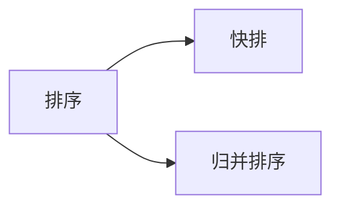
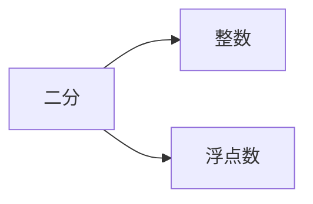

## 基础算法

```
课上：理解算法主要思想
课后：理解代码母版，背过（可以快速的写出模板题）
	 根据模板题写出例题
	 
提高熟练度：对一道题目重复3~5次
```


### 快速排序


- 第二步的第一种方法

  

  ```
  开两个数组，a，b
  遍历数组q，当q <= x，把当前遍历的数放到a中
  		 当q >x,把当前遍历的数放到b中
  再把a，b放到q中
  ```

- 第二步的第二种方法

  ```
  	用两个指针，左端点i，右端点j，分别往中间走，i先走，i<x向后移动一位；i>=x，那么这个数应该要放到右半边，此时i保持不动；移动j，j一直往中间走，直到j指向的数<=x（这个数应该要放到左半边），此时，交换这两个数，这样这两个数都放好了位置，i、j继续往中间走，直到i和j相遇
  	
  	为什么是对的：i左边所有的数都<=x，j右边所有的数都>=x，当两个数相遇时也满足这样的条件，所以这样是对的。
  ```

  

- 代码模板

  ```c++
  #include <iostream>
  
  using namespace std;
  
  const int N = 1e6 + 10;
  
  int n;
  int q[N];
  
  void quick_sort(int q[], int l, int r)
  {
      // 判断边界
      if (l >= r) return;
      
      // 取分界点，定义两个指针
      int x = q[(l + r)/2], i = l - 1, j = r + 1;
      
      // 迭代
      while (i < j)
      {
          do i ++; while (q[i] < x);
          do j --; while (q[j] > x);
          if (i < j) swap(q[i], q[j]);
      }
      
      // 递归处理左右两端
      quick_sort(q, l, j);
      quick_sort(q,  j+ 1, r);
  }
  
  int main()
  {
      cin >> n;
      for (int i = 0; i < n; i ++) scanf("%d", &q[i]);
      
      quick_sort(q, 0, n - 1);
      
      for (int i = 0; i < n; i ++) printf("%d ", q[i]);
      
      return 0;
  }
  ```

- 模板难点

  ```
  指针i、j需要指向数组的两侧，而不是数组的两端
      每次交换完两个指针之后，这两个指针都需要往中间移动一格，因此我们在循环时，不管三七二十一先把这两个指针往中间移动一格，再进行判断，所以这两个指针刚开始的时候要放到左右两侧。
      
  quick_sort(q, l, j);
  quick_sort(q,  j+ 1, r);
  这是递归处理左右两端的代码，这里面的分界点取i和j都可以，
  取j时，x不能等于q[r],
  取i时，x不能等于q[l]、q[(l + r)/2],
  如果这样写则会发生死循环
  例子，取j时，x = q[r],
  输入：
  2
  1 2
  则递归处理的函数为：
  quick_sort(q, 0, 1);（与第一次进入的函数相同）
  quick_sort(q, 2, 1);（直接返回）
  所以，这样会产生死循环的结果
  ```

  疑惑:
  为什么不能写为
  quick_sort(q, l, i);
  quick_sort(q,  i + 1, r);
  运行的结果不都为i和j相等的吗？

  

  运行的结果并不是i和j相等，而是i和j错位。

- 总结

  ```
  快排的边界问题有很多，选一个正确的模板，敲熟练就可以了
  ```




### 二分法